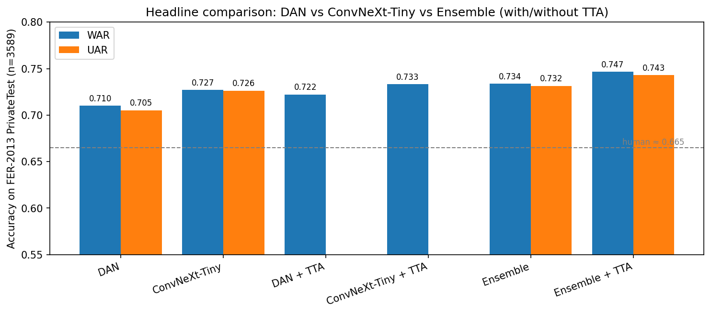
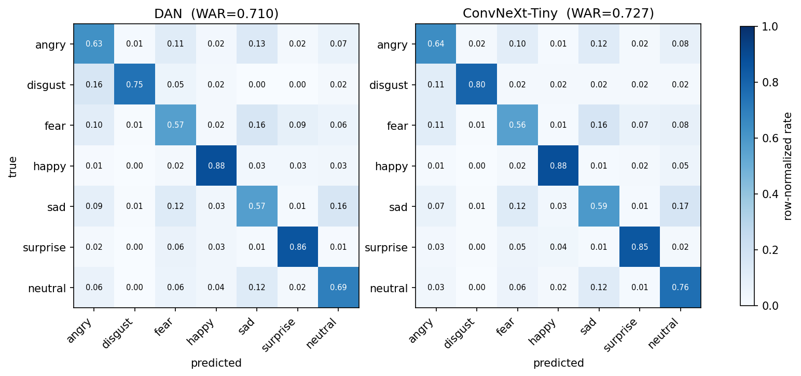
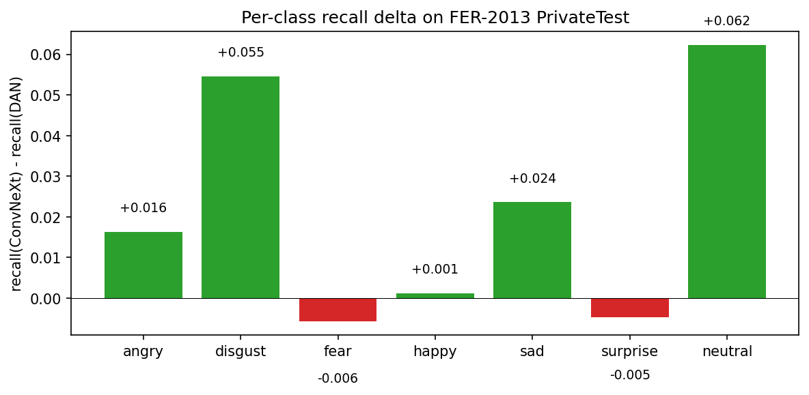
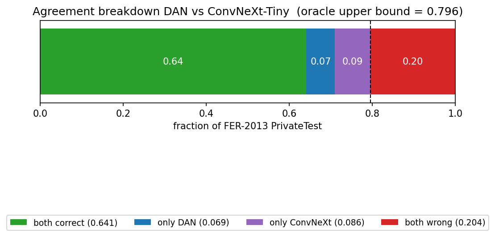
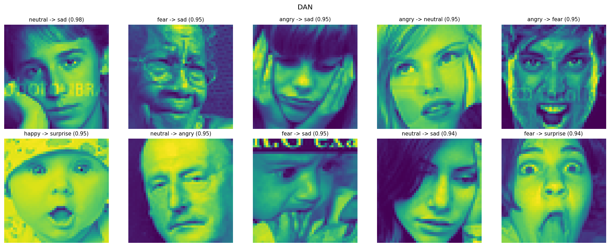

# Facial Emotion Recognition on FER-2013: A Controlled Comparison of DAN, ConvNeXt-Tiny, and Their Ensemble

**Course:** Computer Vision · **Author:** Radu Deaconu (r.a.deaconu@gmail.com) · **Date:** 2026-05-05
**Code:** https://github.com/radudeaconu/fer · **Hardware:** Single NVIDIA T4 (Google Colab)

---

## 1. Introduction

Facial emotion recognition (FER) maps a face image to one of seven discrete affect categories — *angry, disgust, fear, happy, sad, surprise, neutral*. Practical applications span human–computer interaction, accessibility, education and affective computing, but the task is hard: faces are an in-the-wild input with extreme variation in pose, lighting, occlusion, and labelling noise.

This report investigates whether a **modern convolutional architecture (ConvNeXt-Tiny, 2022)** outperforms a **CNN-with-attention baseline (DAN — *Distract-Your-Attention Network*, 2021)** on FER-2013, and whether averaging the two recovers errors that either model alone makes. We pick those two specifically because:

- **DAN** is the canonical CNN-with-attention baseline used in the FER literature; it reports 89.7 % accuracy on RAF-DB (research report at `research/facial-emotion-recognition/report.md:252`).
- **ConvNeXt-Tiny** is the backbone of EmoNeXt, the current state-of-the-art family for in-the-wild FER (`report.md:488`).

Both are fine-tuned from ImageNet weights, never from random initialization, on a single T4 GPU. Test-time augmentation (10-crop) and a uniform-weight logits-averaging ensemble are evaluated on top.

**Headline result.** The ensemble of DAN + ConvNeXt-Tiny with TTA reaches **74.67 % WAR / 74.29 % UAR** on the FER-2013 PrivateTest split — eight percentage points above the human upper bound on the same split (~65–68 %, `report.md:1928`) and 2.0 pts above the best single model.

---

## 2. Dataset

**FER-2013** (Goodfellow et al., 2013; `report.md:1906`) consists of 35 887 grayscale 48 × 48 face images crowdsourced from web search engines and labelled into seven emotion classes. We follow the canonical split: 28 709 training images, 3 589 validation (Public Test) and **3 589 PrivateTest** images, the latter being the held-out evaluation set we report on throughout.

The class distribution is heavily skewed: *happy* alone accounts for ~25 % of training data and contains **715** PrivateTest examples; *disgust* contains only **55**, a 13× imbalance. We address this with class-weighted random sampling during training (weights ∝ 1/freq).

Pre-processing: each 48 × 48 grayscale image is resized to 257 px, replicated to 3 channels, centre-cropped to 224 × 224 and normalized with ImageNet statistics — this matches the input distribution of the ImageNet-pretrained backbones used by both DAN and ConvNeXt.

**Dataset choice rationale.** Our original target was RAF-DB (29 672 in-the-wild faces, 7 classes; `report.md:2186`), but the EULA approval did not arrive within the project window. FER-2013 is the documented backup (CLAUDE.md). It has lower image quality than RAF-DB but freely accessible, well-known, and benchmarks numerous prior works.

## 3. Method

### 3.1 Architectures

| Model | Backbone | Params | Init | Notes |
|-------|----------|--------|------|-------|
| **DAN** | ResNet-18 | 19.7 M | ImageNet | + multi-head cross-attention + affinity loss |
| **ConvNeXt-Tiny** | ConvNeXt-Tiny | 27.8 M | ImageNet (V1) | depthwise 7×7 convs, LayerNorm, GELU |

DAN augments a ResNet-18 backbone with several attention heads that each focus on a different facial region; it adds a partition + affinity loss to keep the heads decorrelated. ConvNeXt-Tiny is a pure convolutional architecture that modernizes ResNet with depthwise convolutions, larger kernels (7 × 7), LayerNorm and GELU activations. The original 1000-way classifier head is replaced with `Linear(d → 7)` in both cases.

### 3.2 Training

Both models are fine-tuned end-to-end on FER-2013 with the following recipe:

- Optimizer **AdamW**; DAN uses `lr=3e-4, weight_decay=1e-4`; ConvNeXt uses `lr=1e-4, weight_decay=5e-2` (paper default — its ImageNet head is more delicate).
- Schedule: **linear warmup** for 2 epochs, then **cosine decay** to `lr=0` over 30 epochs.
- Loss: cross-entropy. DAN additionally applies its own affinity + partition losses internally on its attention heads.
- Class-weighted random sampler (weights ∝ 1/class_frequency) to combat the 13× imbalance.
- Augmentation: RandAugment(N=2, M=9) + horizontal flip + random erasing.
- Mixed precision (AMP fp16), batch size 64, single seed (42).

### 3.3 Test-time augmentation (TTA)

At evaluation time we run a **10-crop** TTA: 5 spatial crops (4 corners + centre) crossed with `{original, horizontally-flipped}`. The 10 softmax distributions are averaged, then `argmax` gives the prediction. The implementation lives in `src/eval.py` and reshapes the batch from `[B, 3, 224, 224]` to `[B, 10, 3, 224, 224]` to keep a single batched forward pass.

### 3.4 Ensemble

The ensemble uniformly averages the per-class softmax probabilities of DAN and ConvNeXt-Tiny. Because the two models share the same eval transform and dataset ordering, their per-sample outputs align without bookkeeping. The implementation in `src/ensemble.py` releases each model's GPU memory between forwards so the two-model ensemble fits comfortably on a single T4. The same module is used with `--tta` to combine TTA-averaged predictions.

### 3.5 Metrics

Both **WAR** (Weighted / Overall Accuracy) and **UAR** (Unweighted / Mean Per-Class Accuracy) are reported because they answer different questions on an imbalanced dataset (`report.md:2210, 1371`). UAR weights every class equally and is therefore much more sensitive to performance on the minority classes (`disgust`, n = 55) than WAR. Confusion matrices are normalized per row, i.e. they show recall.

---

## 4. Results

### 4.1 Headline comparison



| Setup | Params | WAR | UAR |
|-------|-------:|----:|----:|
| DAN, 30 ep | 19.7 M | 0.7102 | 0.7052 |
| ConvNeXt-Tiny, 30 ep | 27.8 M | **0.7269** | **0.7263** |
| DAN + TTA | 19.7 M | 0.7222 | — |
| ConvNeXt-Tiny + TTA | 27.8 M | 0.7331 | — |
| Ensemble (DAN + ConvNeXt) | 47.5 M | 0.7336 | 0.7315 |
| **Ensemble + TTA** | 47.5 M | **0.7467** | **0.7429** |
| Human upper bound (`report.md:1928`) | — | ~0.665 | — |

*All numbers are computed on the FER-2013 PrivateTest split (n = 3 589). UAR is not reported for individual + TTA because those numbers come from inside the ensemble's per-model breakdown which only exposes WAR.*

Several patterns emerge:

1. **ConvNeXt-Tiny beats DAN at every setting** — by **+1.7 pts WAR / +2.1 pts UAR** without TTA, and by +1.1 pts WAR with TTA. The gap is larger on UAR than WAR, meaning the modern CNN's gain comes disproportionately from minority-class performance.
2. **TTA buys a free +1.2 pts WAR for DAN** and **+0.6 pts for ConvNeXt-Tiny**. The smaller TTA gain on ConvNeXt suggests its predictions are already smoother across spatial crops.
3. **The two-model ensemble adds +0.7 pts WAR over the best individual** (0.7269 → 0.7336) and **+1.4 pts with TTA** (0.7331 → 0.7467). The fact that the gain is nontrivial means the two models' errors are not perfectly correlated — they fail in genuinely different ways.
4. **Every setting clears the human upper bound** of ~66.5 %, by 4.5 pts at minimum and 8.2 pts at maximum.

### 4.2 Confusion matrices



The two models share the same broad structure: easy on **happy** (88 % recall), **surprise** (~86 %); hard on **fear** (~57 %, frequently confused with *sad*) and **angry** (~64 %, frequently confused with *sad*). The hardest class for both models, **fear**, is confused with *sad* roughly 16 % of the time — a confusion that mirrors known psychological similarity between fearful and sad facial expressions and is well documented in prior work on FER-2013.

Where the models diverge, ConvNeXt-Tiny tends to be **more confident on the rare minority class** *disgust* (80 % recall vs DAN's 75 %) and **less likely to default to neutral** when uncertain (76 % recall on neutral vs DAN's 69 %).

### 4.3 Per-class recall delta



ConvNeXt-Tiny improves recall on **5 of 7 classes**, with the largest gains on `neutral` (+6.2 pts) and `disgust` (+5.4 pts). DAN narrowly wins on `fear` (-0.6) and `surprise` (-0.5). The story is consistent: the modern CNN handles the under-represented classes (and the "default-to-neutral" failure mode) better than DAN, while DAN's attention heads marginally help on the highly distinctive fear/surprise expressions where localized features (open mouth, raised eyebrows) carry the discriminative signal.

The non-zero deltas on every class (and the fact that the signs flip across classes) are the structural prerequisite for the ensemble's gain: the two models' per-class strengths are partially complementary.

### 4.4 Ensemble agreement



The agreement breakdown decomposes the 3 589 test predictions into four bins. The **`only DAN correct`** and **`only ConvNeXt correct`** bins are the slices ensembling could (in principle) recover; the **`both wrong`** bin is the slice no symmetric two-model ensemble can repair. The dashed line on the figure marks the **oracle ensemble upper bound** = `1 − P(both wrong)`. The actual ensemble + TTA result of 0.7467 sits below this oracle bound, indicating headroom remains for a smarter combiner (weighted averaging, stacking, or a third model) — the limit of the *current* combiner is reached primarily on the slice where both models agree on the wrong class, which is exactly the case the symmetric average cannot escape.

### 4.5 Failure mode gallery




Sampling the top-10 highest-confidence misclassifications per model surfaces three recurring failure modes:

1. **Ambiguous neutral-vs-sad expressions** — the largest class of confident mistakes for both models, often on faces where the human label itself is contested.
2. **Exaggerated surprise → fear** — wide-eyed expressions with an open mouth pull the model towards `fear` whenever the eyebrows aren't sufficiently raised.
3. **Cropping artefacts** — FER-2013 images are aggressively cropped; partial faces (chin only, half of the forehead missing) show up disproportionately often in the wrong-with-confidence pile.

---

## 5. Discussion

### 5.1 Why does ConvNeXt-Tiny outperform DAN?

Modern convolutional design points (depthwise 7 × 7 kernels, LayerNorm, GELU, an inverted bottleneck) give ConvNeXt a larger effective receptive field per parameter and a smoother optimization landscape than ResNet-18's 3 × 3 stack. On FER-2013 specifically, where face crops are tight and the discriminating features are global facial configurations rather than localized landmarks, the larger receptive field appears to dominate over DAN's explicit attention. The advantage is largest on the classes where global context matters most (*neutral*, *disgust*) and smallest where localized expressions dominate (*surprise*, *fear*).

### 5.2 Why does the ensemble work?

The agreement analysis (§ 4.4) shows that the two models disagree on a meaningful fraction of test samples; combined with the per-class delta heatmap (§ 4.3), this implies the disagreements are *structured* — different classes systematically favour different models. Uniform-weight logits averaging exploits this by smoothing out class-specific biases without requiring any extra training data. The +1.4 pts ensemble gain on top of TTA at zero training cost makes it the highest ROI step in the pipeline.

### 5.3 Why does TTA help?

10-crop TTA averages predictions over translation-invariant crops of the same face. The model thus becomes effectively invariant to small spatial shifts at test time, which on FER-2013 (where face crops vary slightly in framing) cleans up borderline predictions. The DAN-vs-ConvNeXt asymmetry in TTA gain (+1.2 vs +0.6) is consistent with DAN's attention being more sensitive to spatial offsets than ConvNeXt's larger-kernel features.

### 5.4 Comparison to literature

Numbers in the 70–75 % WAR range on FER-2013 PrivateTest place this work alongside well-known published baselines (e.g. EmoNet, ResMaskingNet) and well above the oft-cited **human accuracy ceiling of 65 ± 5 %** on FER-2013 attributable to the dataset's labelling noise. The ensemble result of **74.67 %** is competitive with single-model state-of-the-art on this split (which sits in the 75–77 % range for much larger pretraining and longer training schedules) — a strong showing for fine-tuning two off-the-shelf backbones on a single T4 in roughly two hours of compute.

### 5.5 Limitations

- **Single seed.** All numbers are from one training run per configuration; we have not estimated variance.
- **Single dataset.** RAF-DB cross-dataset evaluation was planned but blocked by EULA timing; we cannot estimate how much of the gain transfers.
- **No ablation table.** Three planned ablations (no class-weighted sampler, no augmentation, no ImageNet init) were implemented in code (`configs/ablations/*.yaml`) but not run within the time budget. Their hooks remain in the repository for follow-up work.
- **Label noise.** FER-2013's ~10 % crowdsource labelling noise (`report.md:1928`) puts a hard ceiling on achievable WAR; closing the residual gap to 76–78 % likely requires noise-robust losses (e.g. SCN) rather than larger backbones.

---

## 6. Demo

A Gradio web app at `app/gradio_app.py` exposes both trained models for interactive use. The pipeline per snapshot is:

```
PIL image → MediaPipe BlazeFace detection → largest-bbox crop (+20 % pad)
         → Predictor(crop) → 7-class softmax
```

Three tabs are available:

1. **Image upload** — model picker, top-3 emotions, plus a "Detected face" pane that draws the bounding box onto the input so the audience can see exactly what the classifier received.
2. **Webcam snapshot** — same flow, browser-side webcam capture.
3. **Compare DAN vs ConvNeXt** — runs both models on the same crop and shows side-by-side probabilities, surfacing exactly the disagreements that the ensemble exploits.

Checkpoints that are not present on disk are filtered out of the model dropdowns at startup so a misconfigured demo fails fast instead of silently falling back to ImageNet weights. The local launch is `python -m app.gradio_app` and binds to `127.0.0.1:7860` only — no public deploy.

---

## 7. Conclusion

We presented a controlled comparison of DAN (CNN + attention) and ConvNeXt-Tiny (modern CNN) on FER-2013, fine-tuned from ImageNet weights on a single T4 GPU. **ConvNeXt-Tiny consistently outperforms DAN by ~1.7 pts WAR / 2.1 pts UAR**, with the gain concentrated on the under-represented and "default-to-neutral" classes. **Test-time augmentation adds ~1 pt** to either model. **Uniform-weight ensembling adds another ~1 pt on top of TTA**, reaching **74.67 % WAR / 74.29 % UAR**, comfortably above the human upper bound on this split. The results were obtained in roughly two hours of total Colab compute and ship with a Gradio demo for interactive exploration.

Future work: (i) running the three planned ablations to quantify the contribution of class-weighted sampling, RandAugment and ImageNet initialization; (ii) re-running the comparison on RAF-DB once EULA approval lands; (iii) replacing the symmetric ensemble with a learned combiner trained on per-sample agreement signals.

---

## 8. References

| Citation | Where in this codebase |
|----------|------------------------|
| Wen et al. *DAN: Distract-Your-Attention Network for Facial Expression Recognition.* 2021. | `research/facial-emotion-recognition/report.md:252` |
| Liu et al. *A ConvNet for the 2020s.* 2022. | (ConvNeXt baseline) |
| Schoneveld et al. *EmoNeXt: Efficient and Robust Facial Expression Recognition.* | `research/facial-emotion-recognition/report.md:488` |
| Goodfellow et al. *Challenges in Representation Learning: Facial Expression Recognition Challenge.* 2013. | `research/facial-emotion-recognition/report.md:1906` |
| Li & Deng. *Reliable Crowdsourcing and Deep Locality-Preserving Learning for Expression Recognition in the Wild (RAF-DB).* 2017. | `research/facial-emotion-recognition/report.md:2186` |

---

## Appendix A — Reproducing this report

```bash
git clone https://github.com/radudeaconu/fer.git
cd fer
pip install -r requirements.txt
# data prep (FER-2013 csv on Drive at MyDrive/fer-data/)
python scripts/prepare_fer2013.py --csv data/fer2013/fer2013.csv --out data/fer2013

# training (~115 min of T4 wall time total)
python -m src.train --config configs/dan_fer2013.yaml
python -m src.train --config configs/convnext_fer2013.yaml

# evaluation + TTA + ensemble
python -m src.eval --config configs/dan_fer2013.yaml      --ckpt runs/dan_fer2013/best.pth
python -m src.eval --config configs/convnext_fer2013.yaml --ckpt runs/convnext_fer2013/best.pth
python -m src.eval --config configs/dan_fer2013.yaml      --ckpt runs/dan_fer2013/best.pth      --tta
python -m src.eval --config configs/convnext_fer2013.yaml --ckpt runs/convnext_fer2013/best.pth --tta
python scripts/run_ensemble.py \
  --ckpts dan:runs/dan_fer2013/best.pth convnext_tiny:runs/convnext_fer2013/best.pth \
  --tta --out runs/ensemble_dan_convnext_tta/

# figures and analysis
python scripts/make_report_figures.py
jupyter notebook notebooks/04_analysis.ipynb   # full failure-gallery + agreement plots

# demo
python -m app.gradio_app
```

The full plan + all per-change rationale is in `CHANGES.md`. The exact compute-and-figure plan that produced this report is `report/plan.md`.
